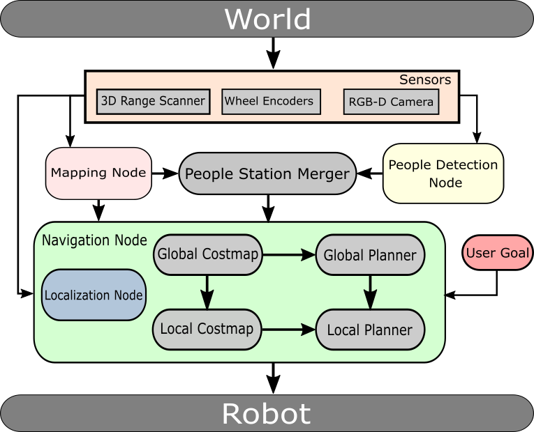

# thesis_ws
Repository of the work developed in my thesis in FCT/UNL

## Overview

This is a ROS package that joins people detection into the navigation process.

### Instalation

* Download the packages in src folder.

* Install dependencies specified in grid_map and spencer_people_tracking packages.

* Install libsvm.

        sudo apt-get install libsvm-*
        
* Install lms1xx.

        sudo apt-get install ros-kinetic-lms1xx
        
* Install ROS multimaster_launch.

        sudo apt-get install ros-kinetic-multimaster-*
        
* Install interactive_markers twist server.

        sudo apt-get install ros-kinetic-interactive-marker-*
        
* Install twist mux.

        sudo apt-get install ros-kinetic-twist-mux
        
* Install robot-pose-ekf.

        sudo apt-get install ros-kinetic-robot-pose-ekf 

        
* Install AMCL localization package.

        sudo apt-get install ros-kinetic-amcl
        
* Install SLAM Gmapping.

        sudo apt-get install ros-kinetic-gmapping
        
        
* Install Navigation package.

        sudo apt-get install ros-kinetic-navigation
        
* Install grid_map package.

        sudo apt-get install ros-kinetic-grid-map
        sudo apt-get install ros-kinetic-grid-map-*
        
* Install gazebo plugins.

        sudo apt-get install ros-kinetic-hector-gazebo-plugins 
        
* Install spencer_people_tracking.

        sudo apt-get install ros-kinetic-spencer-people-tracking-full
        
 * Or just give the script in /thesis/scripts folder permissions and run it.
        
        chmod +x install_dependencies.sh
        sudo ./install_dependencies.sh
        
 * Export gazebo models in ~/.bashrc.
 
        export GAZEBO_MODEL_PATH=<your_path>/models:$GAZEBO_MODEL$
 
### Running

* Launch the simulated world and jackal descriptions and controls.

        roslaunch human_aware_navigation world.launch

* Launch mapping. 

        roslaunch human_aware_navigation mapping.launch

* Launch navigation, people detection and this thesis middleware.

        roslaunch human_aware_navigation bringup.launch
       
### Important Notes

* The labeled map image need to be oriented as you want it to be read. You can see the examples for orientation.
